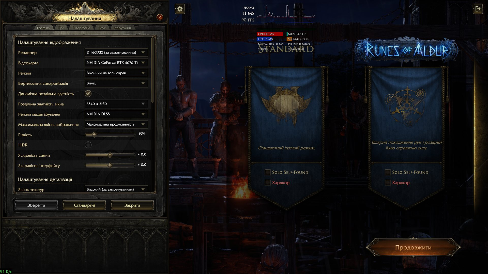
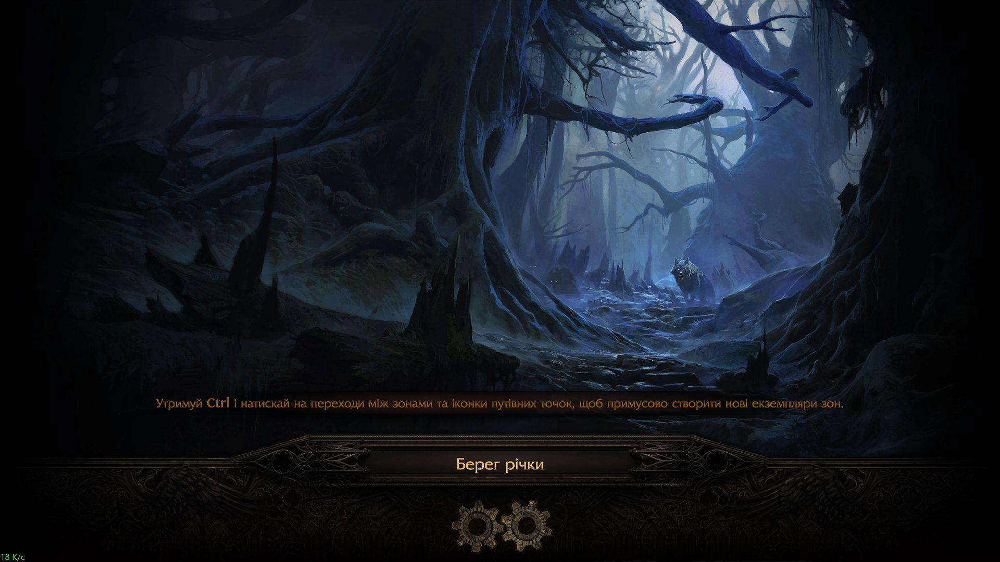
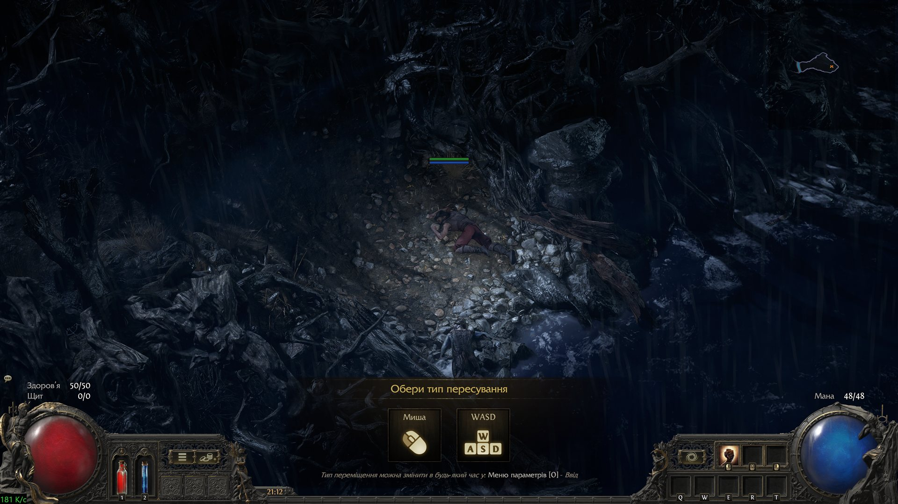
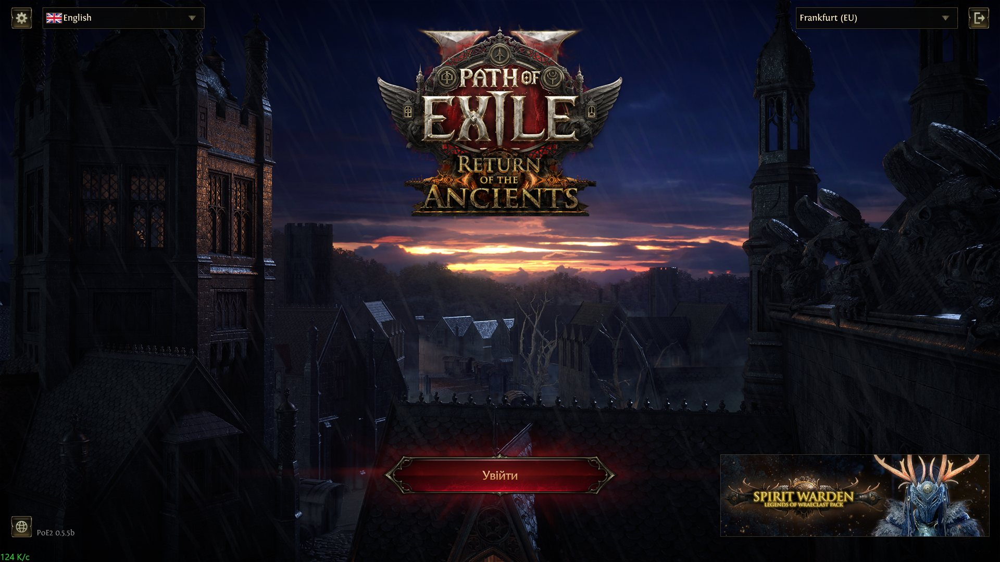

# Path of Exile 2 — українська локалізація (ШІ-переклад)

Неофіційний фанатський переклад **Path of Exile 2** українською мовою.

Переклад виконано **штучним інтелектом** (модель `gemma4:31b` через Ollama Cloud) за словником ігрових термінів. **Вичитка триває:** інтерфейс, налаштування й частину підказок уже перевірено в грі та виправлено вручну, решту вичитуємо в процесі гри. Це не професійна локалізація: трапляються неточності, і ми вдячні за кожну правку.

> ⚠️ **Важливо**
> - Проєкт **не пов'язаний** із Grinding Gear Games.
> - Патч **змінює файли клієнта гри**. Це порушує Умови використання GGG. Path of Exile 2 — онлайн-гра, тож **ризик блокування акаунта — повністю на вашу відповідальність**.
> - Відкотити все можна будь-коли: Steam → Path of Exile 2 → Властивості → Встановлені файли → **Перевірити цілісність файлів гри**.

## Скріншоти

| | |
|---|---|
|  |  |
| Налаштування і вибір ліги | Екран завантаження |
|  |  |
| Початок гри | Екран входу |

## Сумісність

| | |
|---|---|
| Версія гри | **0.5.5b** (Steam build 25244054, оновлення від 11.09.2026), ліга Runes of Aldur |
| Версія перекладу | v1.6.2 (17.09.2026) |

Після патчів GGG нові рядки лишаються англійськими, доки не вийде оновлення перекладу; вже перекладене при повторному запуску `INSTALL.bat` відновлюється.

## Що перекладено

| Частина | Стан |
|---|---|
| Інтерфейс і налаштування | ✅ |
| Характеристики, модифікатори, підказки | ✅ |
| Уміння, пасивне дерево, сходження | ✅ |
| Описи предметів | ✅ |
| Квести, діалоги, лор | ✅ |
| Магазин (косметика) | ✅ |

**Навмисно лишаються англійськими:**
- **назви предметів** (Giant Mana Flask, Superior …) — щоб працювали фільтри луту й трейд-програми;
- **назви класів у вікні вибору персонажа** — гра використовує їх як внутрішні ідентифікатори, переклад ламає клієнт.

Окремі рядки, які не пройшли автоматичну перевірку розмітки, теж лишились англійськими — це безпечніше, ніж зламана підказка.

## Встановлення

**Потрібно:** Windows і Path of Exile 2 у Steam. Усе інше вже є в архіві релізу — встановлювати нічого не треба.

**Кроки:**
1. Завантажте архів `PoE2-Ukrainian-*.zip` з [Releases](https://github.com/d3n0at/poe2-ukrainian/releases) і розпакуйте в будь-яку теку.
2. **Закрийте гру.**
3. Запустіть `INSTALL.bat` і дочекайтеся «Готово». Інсталятор сам знайде гру і файл `oo2core_9_win64.dll` серед ваших ігор (Steam, Epic Games).
4. Запустіть гру. Переклад записується поверх англійської, тому інсталятор сам перемикає мову гри на **English**, якщо була обрана інша.

**Якщо інсталятор не знайшов `oo2core_9_win64.dll`:** це бібліотека стиснення Oodle. Ми не можемо її поширювати (пропрієтарна). Вона є в теці `…\Binaries\Win64\` будь-якої вашої гри на Unreal Engine 4/5 — покладіть її поруч із `INSTALL.bat` і запустіть його знову.
**Якщо щось пішло не так:** інсталятор пише, що саме не так, українською (немає Node.js, немає oo2core, гра запущена, не знайдено гру). Якщо гра стоїть не в Steam-бібліотеці, задайте шлях: у PowerShell `$env:POE2_DIR='D:\Games\Path of Exile 2'` і запустіть `INSTALL.bat` з того ж вікна.

## Після оновлення гри

Оновлення PoE 2 повертає частину файлів до англійської. Просто закрийте гру і знову запустіть `INSTALL.bat`.

## Видалення

Steam → Path of Exile 2 → Властивості → Встановлені файли → **Перевірити цілісність файлів гри**.

## Як допомогти

- Побачили помилку, кальку чи текст, що не влазить у кнопку — відкрийте **Issue** зі скріншотом.
- Готову правку можна запропонувати через Pull Request у `translations/overrides_uk.json` (англійський рядок → український).

## Подяки та ліцензії

- **[poe2-polish-patch](https://github.com/rocky6777/poe2-polish-patch)** (rocky6777, MIT) — основа інструментів запису перекладу.
- **[LibGGPK3](https://github.com/aianlinb/LibGGPK3)** (aianlinb) — робота з бандлами гри.
- **[pathofexile-dat](https://github.com/SnosMe/poe-dat-viewer)** (SnosMe, MIT) і **dat-schema** (poe-tool-dev) — читання даних гри.
- **[«Відеоігрова та коловідеоігрова термінологія»](https://docs.google.com/spreadsheets/d/1p0H6dFzah3INkemHXGju_tjvbXzpYnbOyNzJLzCWGrQ)** — UnlocTeam, SBT Localization та ін. (CC BY-NC) — термінологія.
- **[«Українські вигуки і звуконаслідувальні слова»](https://steamcommunity.com/groups/UkrainianTranslation/discussions/0/2264691750499622777/)** — спільнота Ukrainian Translations у Steam.

Path of Exile є торговельною маркою Grinding Gear Games. Усі оригінальні тексти гри належать GGG.

- Код цього репозиторію — MIT (див. `LICENSE`).
- Український переклад поширюється **лише для некомерційного використання** (CC BY-NC 4.0).
